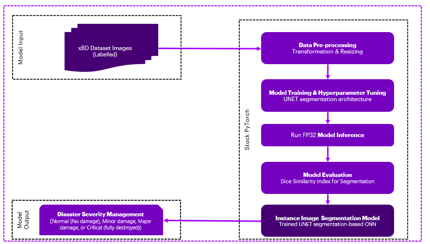
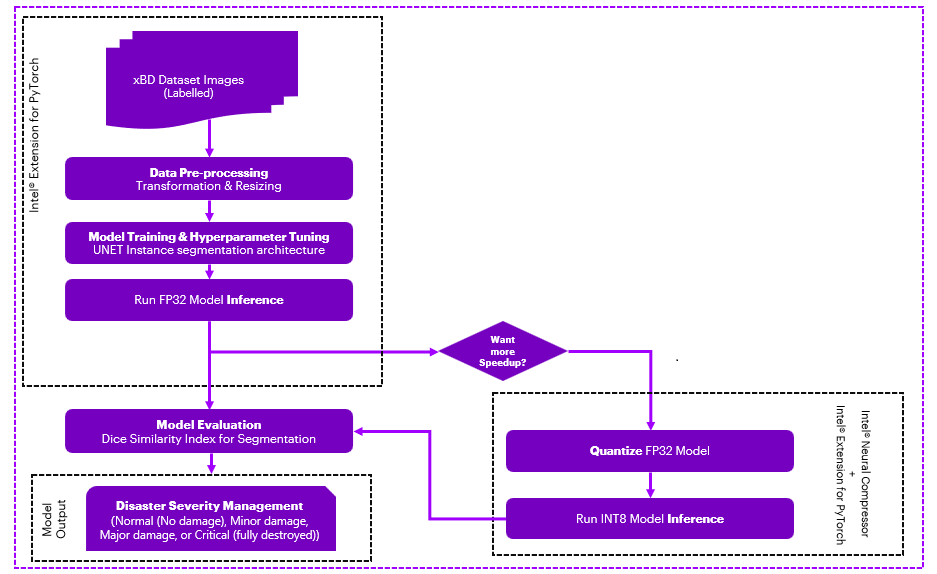
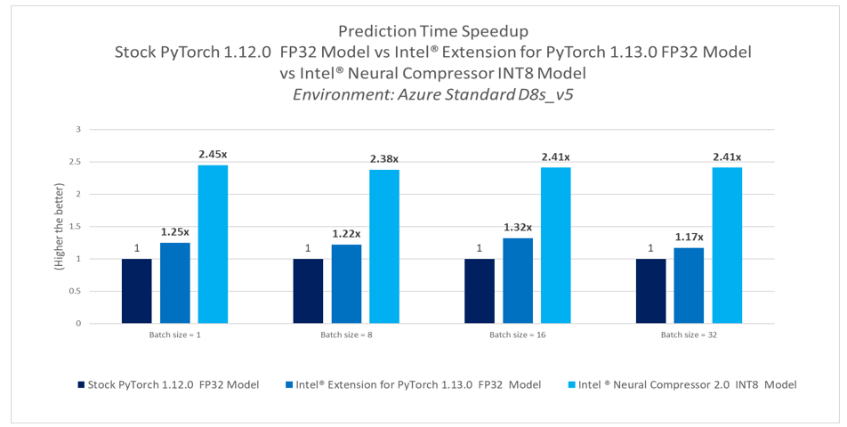
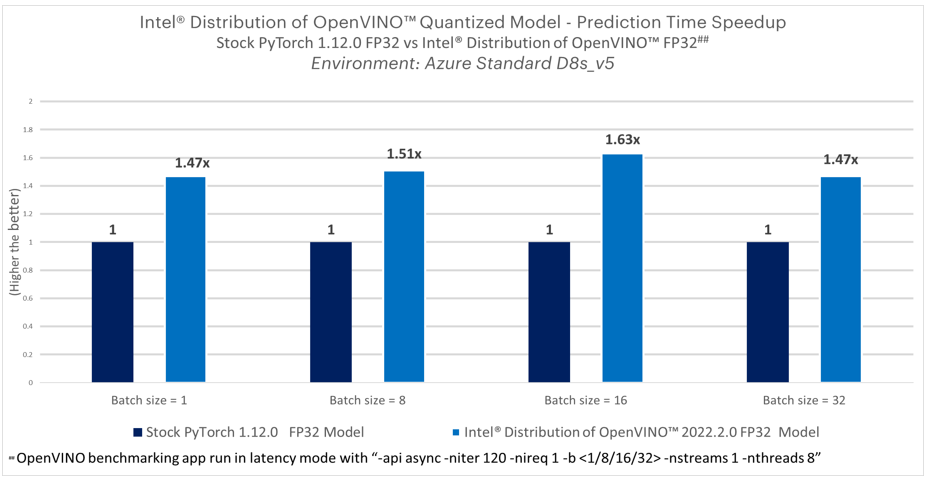

# Applications of AI in Satellite Image processing instance segmentation using PyTorch
## Introduction
One of the important applications of satellite image processing is in Disaster Management i.e., monitoring natural disasters like earthquakes, hurricanes, tropical cyclones, floods, etc., and assessing the damages. It helps to strategically plan and control disasters as and when they occur. 
## Table of Contents 
 - [Purpose](#purpose)
 - [Reference Solution](#reference-solution)
 - [Reference Implementation](#reference-implementation)
 - [Intel® Optimized Implementation](#optimizing-the-end-to-end-solution-with-intel%C2%AE-oneapi-components)
 - [Performance Observations](#performance-observations)

## Purpose
There are vast applications of satellite imaging services in geospatial mapping, disaster management, urban planning, agriculture, military and defense, environmental monitoring and energy management.

When a natural disaster (let's say an earthquake) has occurred in an area, a satellite captures various images and collects data for damage assessment and response. Then, satellites downlink the collected images/data when they come within range of ground stations on Earth. Downlinking is limited to a few times a day and only for a few minutes each time depending on the priority, thus limiting the amount of data received and increasing latency to receive the complete data. If the data were to be processed at the ground stations to generate insights, there would be a huge delay between data acquisition at the satellite and response to the insights generated from the data. Additionally, data exchange between satellites and ground stations is expensive.

AI-based technological solutions for satellite image processing have great potential in disaster management and response. Satellite image processing at Edge can create efficacies in processing the data in space, reducing the quantum of data exchange between satellites and ground stations, reducing the latency between data acquisition, insights generation and response.
Effective disaster management would require predictive insights and real-time information regarding impending/already occurred disasters. This would imply low latency/instantaneous insights on the satellite images.


## Reference Solution  
This reference kit leverages Intel® oneAPI to demonstrate the PyTorch-based AI Model that works on satellite-captured images and the AI models developed to help to assess the severity of damage caused by a natural disaster.

The goal is to segment the buildings from the satellite-captured images and assess the severity of structural damage that occurred to the buildings due to the natural disaster in a particular area. The extent of damage in the buildings is categorized into 4 groups - Normal (No damage), Minor damage, Major damage, and Critical (fully destroyed).

U-Net convolutional neural network architecture has been used to help segment images, captured using onboard imaging devices on satellites targeted for disaster management planning. 
It is a widely adopted convolutional neural network architecture for fast and precise segmentation of images

The experiment aims to take the image captured by the satellite (xBD dataset) post preprocessing as input and pass it through the instance-segmentation model (U-Net architecture) to accurately recognize the buildings and assess the damage to put in the defined category; then benchmark speed and accuracy of training, inference both (batch and real-time) against Intel’s technology.

GPUs are the natural choice for deep learning and AI processing to achieve a higher Frames Per Second (FPS)   rate, this reference solution uses model quantization to speed up segmentation process  on  CPU based computing platform while maintaining the ideal FPS (for image segmentation applications) to realize a cost-effective option for low power computing platform on Satellites while maintaining the accuracy level   of the prediction similar to regular floating point model.

### **Key Implementation Details**

- The difference between using Intel® oneAPI AI Analytics Toolkit against the stock version has been highlighted in this reference kit. Implementation on Intel® Extension for PyTorch* v1.13.0 has been compared against the stock version of PyTorch v1.12.0.<br>
- U-Net architecture has been used on the images captured by satellite to assess the severity of structural destruction caused by the disaster. The extent of damage in the buildings is categorized into 4 groups - Normal (No damage), Minor damage, Major damage, and Critical (fully destroyed). The inference time and the model's performance are captured for multiple runs on the stock version and the Intel® oneAPI version.
- When it comes to the deployment of this model on edge devices, with less computing and memory resources, the experiment applies further quantization and compression to the model whilst keeping the same level of accuracy showing a more efficient utilization of underlying computing resources . Model has been quantized using Intel® Neural Compressor & Intel® Distribution of OpenVINO™ Toolkit, which have shown high-performance vectorized operations on Intel® platforms.

## Reference Implementation

### ***E2E Architecture***
### **Use Case E2E flow**
 

### Expected Input-Output

**Input**                                 | **Output** |
| :---: | :---: |
| Satellite captured images           |  Damage severity assessment (Normal (No damage), Minor damage, Major damage, or Critical (fully destroyed)).
### Reference Sources
*DataSet*: https://xview2.org/dataset <br>

*Case Study & Repo*:https://github.com/milesial/Pytorch-UNet

### Notes
***Please see this data set's applicable license for terms and conditions. Intel® Corporation does not own the rights to this data set and does not confer any rights to it.***

### Repository clone and Anaconda installation

###  For cloning the repository  please execute below 

```
git clone https://github.com/oneapi-src/disaster-appraisal
cd disaster-appraisal
```

>**Note**: In this reference kit implementation already provides the necessary conda environment configurations to set up the software requirements. To utilize these environment scripts, install Anaconda/Miniconda by following the instructions at the following link<br>[Anaconda installation](https://docs.anaconda.com/anaconda/install/linux/)

## Overview
### ***Software Requirements***
| **Package**                | **Stock Python**                
| :---                       | :---                            
| OpenCV     | opencv-python=4.5.5.64
| NumPy               | numpy=1.23.1
| PyTorch              | torch=1.12.0
| Intel® Extension for PyTorch         | NA                              
| Intel® Neural Compressor         | NA                                                      

## Environment

Below are the developer environment used for this module on Azure. All the observations captured are based on this environment setup.

**Size** | **CPU Cores** | **Memory**  | **Intel® CPU Family**
| :--- | :--: | :--: | :--:
| *Standard_D8_V5* | 8 | 32GB | ICELAKE

**YAML file**                                 | **Environment Name** |  **Configuration** |
| :---: | :---: | :---: |
| `env/stock/stock-satellite.yml`             | `stock-satellite` | Python v3.9 with stock PyTorch v1.12.0

### Dataset

| **Use case** | Automated methods to assess damage severity from the Satellite captured images
| :--- | :---
| **Object of interest** | Damage severity assessment
| **Dataset** | https://xview2.org/dataset
| **Train images & Test images** | 5598 & 1866
| **Size** | 1024*1024 <br>


### Usage and Instructions

Below are the steps to reproduce the benchmarking results given in this repository
1. Environment Creation
2. Dataset preparation
3. Training & Hyperparameter tuning
4. Model Inference


#### 1. Environment Creation

**Setting up the environment for Stock PyTorch**<br>Follow the below conda installation commands to set up the Stock PyTorch v1.12.0 environment for the model Training and Hyperparameter Tuning & Inferencing. 

```sh
conda env create -f env/stock/stock-satellite.yml
```
*Activate stock conda environment*

Use the following command to activate the environment that was created:

```sh
conda activate stock-satellite
```
#### 2. Data preparation

> Data extraction steps from tar files are provided inside the data folder in data.txt file.
<br>Registration is required in order to download the data, and when it has been authorized by the appropriate team, the user can download and use it for benchmarking.

<br>The following steps need to be followed after downloading the data:

```sh
cd data
tar -xvf train_images_labels_targets.tar
tar -xvf test_images_labels_targets.tar
```


<br> Make sure folder structure should look like same as below after unzipping the data tar files .</br>
```
data/
└------- train
    ├    ├── images
    │    ├── targets
    │    ├── labels
    │  
    │
    └----test
         ├── images
         ├── targets
         ├── labels
        
```

#### 3. Training
 Running Training using Stock PyTorch v1.12.0 
> Activate Stock Environment before running

 ```
 usage: run_modeltraining.py [-h] [--batch_size BATCH_SIZE] --dataset_file DATASET_FILE [-i INTEL] --save_model_path SAVE_MODEL_PATH

optional arguments:
  -h, --help            show this help message and exit
  --batch_size BATCH_SIZE, --batch_size BATCH_SIZE
                        batch size exampes: 6, 12
  --dataset_file DATASET_FILE, --dataset_file DATASET_FILE
                        dataset file for training
  -i INTEL, --intel INTEL
                        use 1 to enable intel model save, default is 0
  --save_model_path SAVE_MODEL_PATH, --save_model_path SAVE_MODEL_PATH
                        give the directory path to save the model
                   
 ```

**Command to run training**
```sh
python src/run_modeltraining.py  --batch_size 6  --dataset_file  ./data  --intel 0  --save_model_path  ./model
```
By default, trained model will be saved in "model" folder.

#### Hyperparameter tuning

Hyperparameter tuning is important because they directly control the behavior of the training algorithm and have a significant impact on the performance of the model is being trained. The Hyperparameters considered for tuning to reach maximum accuracy on the training set are: - Learning Rate, Epochs, Optimizer, and Batch size.

```
 usage: run_hyperparameter.py [-h] [--batch_size BATCH_SIZE] --dataset_file DATASET_FILE [-i INTEL] --save_model_path SAVE_MODEL_PATH

optional arguments:
  -h, --help            show this help message and exit
  --batch_size BATCH_SIZE, --batch_size BATCH_SIZE
                        batch size exampes: 6, 12
  --dataset_file DATASET_FILE, --dataset_file DATASET_FILE
                        dataset file for training
  -i INTEL, --intel INTEL
                        use 1 to enable intel PyTorch optimizations, default is 0
  --save_model_path SAVE_MODEL_PATH, --save_model_path SAVE_MODEL_PATH
                        give the directory path to save the model
                      
 ```
 
**Hyperparameters used here are as below**
```
"learning rates"      : [0.001, 0.00001]
"optimizers"          : ["Adam", "adadelta", "rmsprop"]
```

**Command to run Hyperparameter Tuning**
```sh
python src/run_hyperparameter.py  --batch_size 6  --dataset_file  ./data  --intel 0  --save_model_path  ./model
```
By default, trained model will be saved in "model" folder

#### 4. Inference

 Running inference using Stock PyTorch v1.12. 
> Activate Stock Environment before running

```
usage: run_inference.py [-h] [--intel I] [--batch-size B] --save_model_path SAVE_MODEL_PATH --data_path DATA_PATH

Inference on test images with FP32/INT8 model

optional arguments:
  -h, --help            show this help message and exit
  --intel I, -i I       Intel Optimizations for pytorch, default value 0
  --batch-size B, -b B  Batch size
  --save_model_path SAVE_MODEL_PATH, -m SAVE_MODEL_PATH
                        give the directory of the trained checkpoint.
  --data_path DATA_PATH, -d DATA_PATH
                        give the directory of test data folder.
  ```

**Command to run inference**

```sh

 python src/run_inference.py -i 0 -b 1  --save_model_path ./model/stock/checkpoint.tar  --data_path ./data/test

```
#### Accuracy evalution of the above  model 
```
sage: run_evalution.py [-h] [--intel I] [--batch-size B] --save_model_path SAVE_MODEL_PATH --data_path DATA_PATH [--openvino OPENVINO]

Evaluting Accuracyon test images with FP32/INT8/OPENVINO model

optional arguments:
  -h, --help            show this help message and exit
  --intel I, -i I       Intel Optimizations for pytorch, default value 0
  --batch-size B, -b B  Batch size
  --save_model_path SAVE_MODEL_PATH, -m SAVE_MODEL_PATH
                        give the directory of the trained checkpoint
  --data_path DATA_PATH, -d DATA_PATH
                        give the directory of the test folder
  --openvino OPENVINO, -o OPENVINO
                        please ensble this flag only openvino env

  ```

**Command to execute**

```sh
 python src/run_evalution.py  -i 0  --batch-size 1 --save_model_path ./model/stock/checkpoint.tar  --data_path ./data/test -o 0

```


## Optimizing the E2E solution with Intel® oneAPI components

### **Use Case E2E flow**


### **Optimized software components**
| **Package**                | **Intel® Distribution for Python**                
| :---                       | :---                            
| Opencv     | opencv-python=4.5.5.64
| Numpy               | numpy=1.23.1
| PyTorch              | torch=1.13.x
| Intel® Extension for PyTorch         | intel-extension-for-pytorch=1.13.0                              
| Intel® Neural Compressor         | neural-compressor=2.0   

### **Optimized Solution setup**

**YAML file**                                 | **Environment Name** |  **Configuration** |
| :---: | :---: | :---: |
`env/intel/intel-satellite.yml`             | `intel-satellite` | Python v3.9 with Intel® Extension for PyTorch v1.13.0 |

### Usage and Instructions
Below are the steps to reproduce the benchmarking results given in this repository
1. Environment Creation
2. Model Training &  Hyperparameter tuning
3. Model Inference
4. Quantize trained models using INC and benchmarking
5. Quantize trained models using Intel® Distribution of OpenVINO™ Toolkit and benchmarking

#### 1. Environment Creation

**Setting up the environment for Intel® Extension for PyTorch**<br>Follow the below conda installation commands to setup the Intel® Extension for PyTorch environment for the model Training and Hyperparameter Tuning & Inferencing.
```sh

conda env create -f env/intel/intel-satellite.yml
```
*Activate Intel® conda environment*

Use the following command to activate the environment that was created:

```sh
conda activate intel-satellite
```
>**Note**: Users can use same environment for Quantization using Intel® Neural Compressor.

#### 2. Training
 Running Training using of Intel® Extension for PyTorch v1.13.0
> Activate Intel Environment before running

 ```
usage: run_modeltraining.py [-h] [--batch_size BATCH_SIZE] --dataset_file DATASET_FILE [-i INTEL] --save_model_path SAVE_MODEL_PATH

optional arguments:
  -h, --help            show this help message and exit
  --batch_size BATCH_SIZE, --batch_size BATCH_SIZE
                        batch size exampes: 6, 12
  --dataset_file DATASET_FILE, --dataset_file DATASET_FILE
                        dataset file for training
  -i INTEL, --intel INTEL
                        use 1 to enable intel model save, default is 0
  --save_model_path SAVE_MODEL_PATH, --save_model_path SAVE_MODEL_PATH
                        give the directory path to save the model
  
 ```
**Command to run training**
```sh
OMP_NUM_THREADS=4 KMP_BLOCKTIME=50 python src/run_modeltraining.py  --batch_size 6  --dataset_file ./data  --intel 1  --save_model_path  ./model
```
By default, trained model will be saved in "model" folder.

###3 Hyperparameter tuning

Hyperparameter tuning is important because they directly control the behavior of the training algorithm and have a significant impact on the performance of the model is being trained. The Hyperparameters considered for tuning to reach maximum accuracy on the training set are: - Learning Rate, Epochs, Optimizer, and Batch size.

```
usage: run_hyperparameter.py [-h] [--batch_size BATCH_SIZE] --dataset_file DATASET_FILE [-i INTEL] --save_model_path SAVE_MODEL_PATH

optional arguments:
  -h, --help            show this help message and exit
  --batch_size BATCH_SIZE, --batch_size BATCH_SIZE
                        batch size exampes: 6, 12
  --dataset_file DATASET_FILE, --dataset_file DATASET_FILE
                        dataset file for training
  -i INTEL, --intel INTEL
                        use 1 to enable intel PyTorch optimizations, default is 0
  --save_model_path SAVE_MODEL_PATH, --save_model_path SAVE_MODEL_PATH
                        give the directory path to save the model
                
 ```

**Hyperparameters used here are as below**
```
"learning rates"      : [0.001, 0.00001]
"optimizers"          : ["Adam", "adadelta", "rmsprop"]
```

**Command to run Hyperparameter Tuning**
```sh
OMP_NUM_THREADS=4 KMP_BLOCKTIME=50 python src/run_hyperparameter.py  --batch_size 6  --dataset_file  ./data  --intel 1  --save_model_path  ./model
```
By default, trained model will be saved in "model" folder

#### 4. Inference

 Running inference using of Intel® Extension for PyTorch  v1.13.0 
> Activate Intel Environment before running
```
usage: run_inference.py [-h] [--intel I] [--batch-size B] --save_model_path SAVE_MODEL_PATH --data_path DATA_PATH

Inference on test images with FP32/INT8 model

optional arguments:
  -h, --help            show this help message and exit
  --intel I, -i I       Intel Optimizations for pytorch, default value 0
  --batch-size B, -b B  Batch size
  --save_model_path SAVE_MODEL_PATH, -m SAVE_MODEL_PATH
                        give the directory of the trained checkpoint.
  --data_path DATA_PATH, -d DATA_PATH
                        give the directory of test data folder.
  ```

**Command to run inference**

```sh

 OMP_NUM_THREADS=4 KMP_BLOCKTIME=50 python src/run_inference.py -i 1 -b 1  --save_model_path ./model/intel/checkpoint.tar  --data_path ./data/test

```
#### Accuracy evalution of the above  model 
```
sage: run_evalution.py [-h] [--intel I] [--batch-size B] --save_model_path SAVE_MODEL_PATH --data_path DATA_PATH [--openvino OPENVINO]

Evaluting Accuracyon test images with FP32/INT8/OPENVINO model

optional arguments:
  -h, --help            show this help message and exit
  --intel I, -i I       Intel Optimizations for pytorch, default value 0
  --batch-size B, -b B  Batch size
  --save_model_path SAVE_MODEL_PATH, -m SAVE_MODEL_PATH
                        give the directory of the trained checkpoint
  --data_path DATA_PATH, -d DATA_PATH
                        give the directory of the test folder
  --openvino OPENVINO, -o OPENVINO
                        please ensble this flag only openvino env

  ```

**Command to execute**

```sh

 python src/run_evalution.py  -i 1  --batch-size 1 --save_model_path ./model/intel/checkpoint.tar  --data_path ./data/test -o 0

```
### 5. Quantize trained models using Intel® Neural Compressor

Intel® Neural Compressor is used to quantize the FP32 Model to the INT8 Model. Optimized model is used here for evaluating and timing Analysis.
Intel® Neural Compressor supports many optimization methods.In this case, we used post-training default quantization to quantize the FP32 model.

 Activate Intel® Environment before running

Step-1: Conversion of FP32 Model to INT8 Model

```
usage: run_neural_compressor_conversion.py [-h] [-i INTELFLAG] [--batch_size B] [-o OUTPATH] [-c CONFIG] --save_model_path SAVE_MODEL_PATH

Quantized the UNet

optional arguments:
  -h, --help            show this help message and exit
  -i INTELFLAG, --intelflag INTELFLAG
                        For enabling IPEX Optimizations value of i will be 1 but INC it has to be 0
  --batch_size B, -b B  Batch size
  -o OUTPATH, --outpath OUTPATH
                        absolute path to save quantized model. By default it will be saved in "./inc_compressed_model/output" folder
  -c CONFIG, --config CONFIG
                        Yaml file for quantizing model, default is "./deploy.yaml"
  --save_model_path SAVE_MODEL_PATH, --save_model_path SAVE_MODEL_PATH
                        give the directory path to save the Quantized model
```
**Command to run Intel Neural Compressor Quantization**
```sh  
python src/inc/run_neural_compressor_conversion.py --save_model_path  ./model/intel/checkpoint.tar  --config  ./src/inc/deploy.yaml   --outpath ./model/intel/inc_compressed_model/output -i 0

```
> Quantized model will be saved by default in `./model/intel/inc_compressed_model/output` folder as `best_model.pt`

Step-2: Inferencing using quantized Model

```
usage: run_inference.py [-h] [--intel I] [--batch-size B] --save_model_path SAVE_MODEL_PATH --data_path DATA_PATH

Inference on test images with FP32/INT8 model

optional arguments:
  -h, --help            show this help message and exit
  --intel I, -i I       Intel Optimizations for pytorch, default value 0
  --batch-size B, -b B  Batch size
  --save_model_path SAVE_MODEL_PATH, -m SAVE_MODEL_PATH
                        give the directory of the trained checkpoint.
  --data_path DATA_PATH, -d DATA_PATH
                        give the directory of test data folder.

```
**Command to run inference on quantized model**
```sh
OMP_NUM_THREADS=4 KMP_BLOCKTIME=50 python src/run_inference.py -i 1 -b 1  --save_model_path ./model/intel/inc_compressed_model/output/best_model.pt  --data_path ./data/test

```
####  Accuracy evalution of the above  model 
```
usage: run_evalution.py [-h] [--intel I] [--batch-size B] --save_model_path SAVE_MODEL_PATH --data_path DATA_PATH [--openvino OPENVINO]

Evaluting Accuracyon test images with FP32/INT8/OPENVINO model

optional arguments:
  -h, --help            show this help message and exit
  --intel I, -i I       Intel Optimizations for pytorch, default value 0
  --batch-size B, -b B  Batch size
  --save_model_path SAVE_MODEL_PATH, -m SAVE_MODEL_PATH
                        give the directory of the trained checkpoint
  --data_path DATA_PATH, -d DATA_PATH
                        give the directory of the test folder
  --openvino OPENVINO, -o OPENVINO
                        please ensble this flag only openvino env

  ```

**Command to execute**

```sh
 python src/run_evalution.py  -i 1 --batch-size 1 --save_model_path ./model/intel/inc_compressed_model/output/best_model.pt  --data_path ./data/test -o 0

```
>**Note**: Above inference script can be run in Intel® environment using different batch sizes "-b":{1/8/16/32}<br>
### 6. Conversion to OpenVINO™ FPIR from trained models using Intel® Distribution of OpenVINO™ Toolkit

When it comes to the deployment of this model on edge devices, with less computing and memory resources, we further need to explore options for quantizing and compressing the model which brings out the same level of accuracy and efficient utilization of underlying computing resources. Intel® Distribution of OpenVINO™ Toolkit facilitates the optimization of a deep learning model from a framework and deployment using an inference engine on such computing platforms based on Intel hardware accelerators. Below section covers the steps to use this toolkit for the model quantization and measure its performance.

**Intel® Distribution of OpenVINO™ Intermediate Representation (IR) conversion** <br>
Below are the steps to convert PyTorch trained checkpoint to  PyTorch onnx model and PyTorch onnx model to OpenVINO IR using model optimizer.

*Environment Setup*

Intel® Distribution of OpenVINO™ is installed in openvino-satellite environment. 

**Note**: Before setting up openvino-satellite environment please deactivate existing one by executing below
```sh
Conda deactivate

```
```sh
conda env create -f env/openvino_pot/openvino-satellite.yml
```
**Activate openvino-satellite environment**
```sh
conda activate openvino-satellite

```
**Command to convert onnx model**

```sh
python src/openvino/onnx_model_conversion.py -m  ./model/intel/checkpoint.tar  -output ./model

```

**Command to create Intel® Distribution of OpenVINO™ FPIR model**

```sh
mo  --input_model model/unet_model.onnx  --output_dir ./model/openvino_fpir/openvino

```

**Note** -  The above step will generate `unet_model.bin` and `unet_model.xml` as output in `model/openvino_fpir/openvino` which can be used with OpenVINO inference application. Default precision is FP32.


#### Accuracy evalution of the above unet_model.xml model (OpenVINO™ FPIR) 
```
usage: run_evalution.py [-h] [--intel I] [--batch-size B] --save_model_path SAVE_MODEL_PATH --data_path DATA_PATH [--openvino OPENVINO]

Evaluting Accuracyon test images with FP32/INT8/OPENVINO model

optional arguments:
  -h, --help            show this help message and exit
  --intel I, -i I       Intel Optimizations for pytorch, default value 0
  --batch-size B, -b B  Batch size
  --save_model_path SAVE_MODEL_PATH, -m SAVE_MODEL_PATH
                        give the directory of the trained checkpoint
  --data_path DATA_PATH, -d DATA_PATH
                        give the directory of the test folder
  --openvino OPENVINO, -o OPENVINO
                        please ensble this flag only openvino env

  ```

**Command to execute**

```sh
 python src/run_evalution.py  -i 1 --batch-size 1 --save_model_path <unet_model.xml path>  --data_path ./data/test -o 1

```


<br>**Running inference using Intel® Distribution of OpenVINO™**<br>Command to perform inference using Intel® Distribution of OpenVINO™. The model needs to be converted to IR format .

*Pre-requisites*
-  Intel® Distribution of OpenVINO™ Toolkit
-  Intel® Distribution of OpenVINO IR converted FP32/16 precision model


**Performance Benchmarking of full precision (FP32) Model**<br>Use the below command to run the benchmark tool for the FPIR model generated using this codebase to assess severity of disaster damage. 

```sh
benchmark_app -m ./model/openvino_fpir/openvino/unet_model.xml  -api async -niter 120 -nireq 1 -b 1 -nstreams 1 -nthreads 8


benchmark_app -m ./model/openvino_fpir/openvino/unet_model.xml  -api async -niter 120 -nireq 1 -b 8 -nstreams 1 -nthreads 8

benchmark_app -m ./model/openvino_fpir/openvino/unet_model.xml  -api async -niter 120 -nireq 1 -b 16 -nstreams 1 -nthreads 8


benchmark_app -m ./model/openvino_fpir/openvino/unet_model.xml   -api async -niter 120 -nireq 1 -b 32 -nstreams 1 -nthreads 8

```


### Observations
This section covers the training & inferencing time comparison between Stock PyTorch v1.12.0 and Intel® Extension for PyTorch v1.13.0 for this model building. The accuracy of the models (both Stock and Intel®) during Training and Hyperparameter tuning is upto 90%.

#### Training and Hyperparameter_tuning  benchmarking results


<br>**Key Takeaways**<br>

-  Training time speedup with Intel® Extension for PyTorch v1.13.0 FP32 Model shows up to 1.14x against Stock Pytorch v1.12.0 FP32 Model.

#### Inference benchmarking results


<br>**Key Takeaways**<br>

-  Real-time prediction time speedup with Intel® Extension for PyTorch v1.13.0 FP32 Model shows up to 1.25x against Stock PyTorch v1.12.0 FP32 Model
-  Batch prediction time speedup with Intel® Extension for PyTorch v1.13.0 FP32 Model shows up to 1.32x against Stock PyTorch v1.12.0 FP32 Model
-  Intel® Neural Compressor quantization offers real-time prediction time speedup up to  2.45x against Stock PyTorch v1.12.0  FP32 model
-  Intel® Neural Compressor quantization offers batch prediction time speedup up to 2.40x against Stock PyTorch v1.12.0 FP32 model.
-  Accuracy drop of 0.01% is observed.


<br>**Key Takeaways**<br>
-  Intel® Distribution of OpenVINO FP32 model offers real-time prediction time speedup up to  1.47x against Stock PyTorch v1.12.0  FP32 model
-  Intel® Distribution of OpenVINO FP32 model offers batch prediction time speedup up to 1.63x against Stock PyTorch v1.12.0 FP32 model.

#### Conclusion
To build an **instance image segmentation model** to assess the severity of damage, machine learning developers will need to train models for substantial amount of dataset. The ability to accelerate training will allow them to train more frequently and achieve better accuracy. Faster inferencing speed will enable them to execute prediction in real-time as well as offline batch processing. This reference kit implementation provides a performance-optimized approach for developing an optimal instance image segmentation model that can be utilized on satellite image processing to evaluate the satellite images for disaster severity assessment.


#### Notices & Disclaimers
Performance varies by use, configuration, and other factors. Learn more on the [Performance Index site](https://edc.intel.com/content/www/us/en/products/performance/benchmarks/overview/). 
Performance results are based on testing as of dates shown in configurations and may not reflect all publicly available updates.  See backup for configuration details.  No product or component can be absolutely secure. 
Your costs and results may vary. Intel technologies may require enabled hardware, software, or service activation.

© Intel Corporation.  Intel, the Intel logo, and other Intel marks are trademarks of Intel Corporation or its subsidiaries.  Other names and brands may be claimed as the property of others.  

To the extent that any public or non-Intel datasets or models are referenced by or accessed using tools or code on this site those datasets or models are provided by the third party indicated as the content source. Intel does not create the content and does not warrant its accuracy or quality. By accessing the public content, or using materials trained on or with such content, you agree to the terms associated with that content and that your use complies with the applicable license.
 
Intel expressly disclaims the accuracy, adequacy, or completeness of any such public content, and is not liable for any errors, omissions, or defects in the content, or for any reliance on the content. Intel is not liable for any liability or damages relating to your use of public content.


# Appendix

### Running on Windows

The original reference kits commands were built using a Linux based system.  In order to run these commands on Windows, go to Start and open WSL.  The Linux instructions provided can then be run in the WSL window starting from the git clone instructions. If WSL is not installed you can [install WSL](https://learn.microsoft.com/en-us/windows/wsl/install).

> **Note** If WSL is installed and not opening, goto Start ---> Turn Windows feature on or off and make sure Windows Subsystem for Linux is checked. Restart the system after enabling it for the changes to reflect.

### Experiment Setup
- Testing performed on: January 2023
- Testing performed by: Intel Corporation
- Configuration Details: Azure Standard_D8_V5 (Intel® Xeon® Platinum 8370C CPU @ 2.80GHz), 1 Socket, 4 Cores per Socket, 2 Threads per Core, Turbo:On, Total Memory: 32 GB, OS: Ubuntu 20.04, Kernel: Linux 5.13.0-1031-azure , Software: PyTorch v1.13, Intel® Extension for PyTorch* v1.13.0, Intel® Neural Compressor v2.0    

| **Optimized for**:  | **Description**                                                                           |
| :------------------ | :---------------------------------------------------------------------------------------- |
| Platform            | Azure Standard D8_v5 : Intel Xeon Platinum 8370C (Ice Lake) @ 2.80GHz, 8 vCPU, 32GB memory |
| Hardware            | CPU                                                                                       |
| OS                  | Ubuntu 20.04                                                                              |
| Software            | PyTorch v1.12, Intel® Extension for PyTorch* v1.13.0, Intel® Neural Compressor v2.0     |
| What you will learn | Intel® oneAPI performance advantage over the stock versions                               |


### Known Issues

1. Environment Creation Issue : Could not build wheels for pycocotools

    **Issue:**
      When creating an intel environment using `intel-satellite` 
      ```
      ERROR: Could not build wheels for pycocotools, which is required to install pyproject.toml-based projects
      ```

    **Solution:**

    Install gcc.  For Ubuntu, this will be: 

      ```bash
      apt install gcc
      sudo apt install libglib2.0-0
      ```

2. ImportError: libGL.so.1: cannot open shared object file: No such file or directory
   
    **Issue:**
      When training the model using `run_modeltraining.py`,
      ```
      ImportError: libGL.so.1: cannot open shared object file: No such file or directory
      or
      libgthread-2.0.so.0: cannot open shared object file: No such file or directory
      ```

    **Solution:**

      Install the libgl11-mesa-glx and libglib2.0-0 libraries. For Ubuntu this will be:

      ```bash
     sudo apt install libgl1-mesa-glx
     sudo apt install libglib2.0-0
      ```


