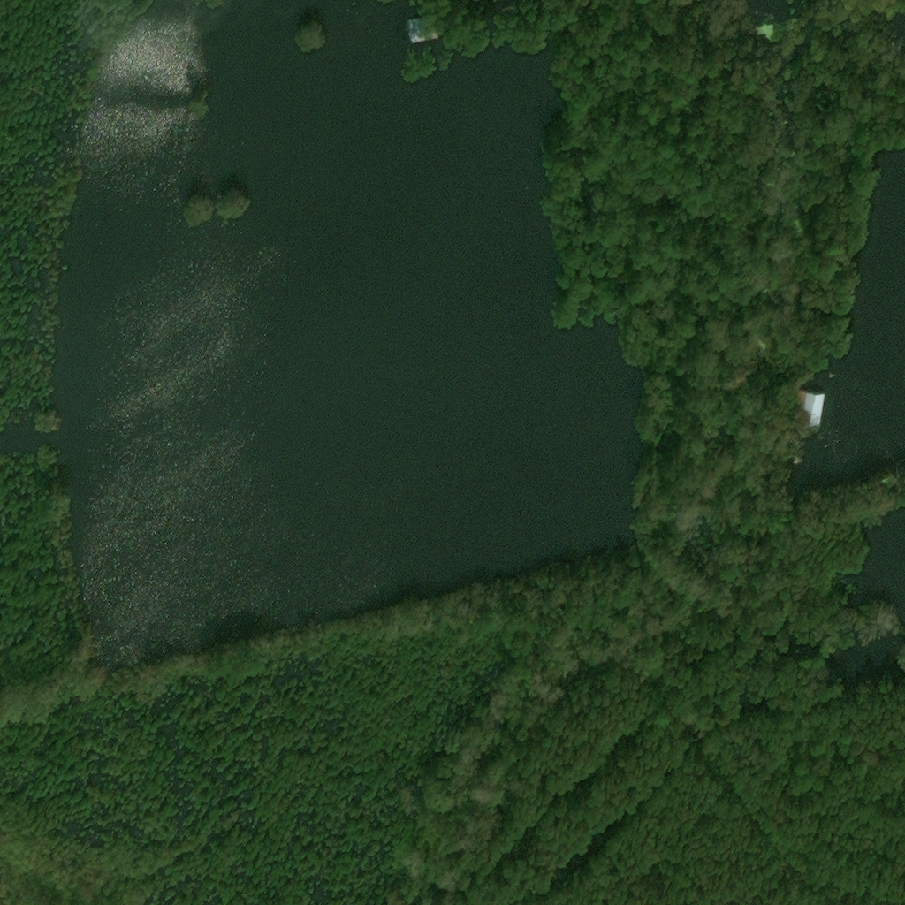

PROJECT NOT UNDER ACTIVE MANAGEMENT

This project will no longer be maintained by Intel.

Intel has ceased development and contributions including, but not limited to, maintenance, bug fixes, new releases, or updates, to this project.  

Intel no longer accepts patches to this project.

If you have an ongoing need to use this project, are interested in independently developing it, or would like to maintain patches for the open source software community, please create your own fork of this project.  

Contact: webadmin@linux.intel.com
# Structural Damage Assessment

### An Application of AI in Satellite Image Processing Instance Segmentation Using PyTorch

## Introduction
Satellite image processing is an indispensable tool in Disaster Management. It plays a vital role in monitoring and assessing the damages caused by natural disasters such as earthquakes, hurricanes, tropical cyclones, floods, etc. It is the key to planning and controlling disasters in a strategic and effective manner.

This reference kit leverages Intel® oneAPI to demonstrate the PyTorch-based AI Model that works on satellite-captured images and the AI models developed to help assess the severity of damage caused by a natural disaster.

Check out more workflow examples in the [Developer Catalog](https://developer.intel.com/aireferenceimplementations).

## Table of Contents
- [Solution Technical Overview](#solution-technical-overview)
- [Solution Technical Details](#solution-technical-details)
  - [Dataset](#dataset)
- [Validated Hardware Details](#validated-hardware-details)
- [How it Works](#how-it-works)
- [Get Started](#get-started)
  - [Download the Workflow Repository](#download-the-workflow-repository)
  - [Set Up Conda](#set-up-conda)
  - [Set Up Environment](#set-up-environment)
- [Ways to run this reference use case](#Ways-to-run-this-reference-use-case)
  - [Run Using Bare Metal](#run-using-bare-metal)
- [Expected Output](#expected-outputs)
- [Summary and Next Steps](#summary-and-next-steps)
- [Learn More](#learn-more)
- [Support](#support)
- [Appendix](#appendix)

## Solution Technical Overview
Satellite imaging services have a wide range of applications in various fields such as geospatial mapping, disaster management, urban planning, agriculture, military and defense, environmental monitoring, and energy management.

When a natural disaster has occurred in an area, such as earthquakes, satellites capture images and collect data to assess damage and plan a response. The collected images and data are downlinked to ground stations on Earth when the satellite comes within range. However, downlinking is limited to a few times a day, for only a few minutes each time, depending on priority. This limits the amount of data received and increases the time it takes to receive the complete data. Processing the data at ground stations to generate insights would result in a significant delay between data acquisition and response. Additionally, exchanging data between satellites and ground stations is expensive.

To address these challenges, AI-based technological solutions for satellite image processing can be used in disaster management and response. Satellite image processing at Edge can reduce the amount of data exchange between satellites and ground stations, as well as the time between data acquisition, insights generation, and response. This can create efficiencies in processing data in space.

To ensure effective disaster management, predictive insights and real-time information on impending or ongoing disasters are required. This means that low latency or instantaneous insights on satellite images are necessary.

The solution contained in this repo uses the following Intel® optimized software components: Intel® Extension for Pytorch\* and Intel® Neural Compressor

### **Optimized software components**

**Intel® Extension for Pytorch\***

The [Intel® Extension for PyTorch\*](https://github.com/intel/intel-extension-for-pytorch/tree/xpu-master) provides:
  - PyTorch* with up-to-date extended features' optimizations for an extra performance boost on Intel® hardware.
  - Optimizations take advantage of AVX-512 Vector Neural Network Instructions (AVX512 VNNI) and Intel® Advanced Matrix extensions (Intel® AMX) on Intel® CPUs as well as Intel® Xe Matrix Extensions (XMX) AI engines on Intel® discrete GPUs.
  - Optimizations for both eager mode and graph mode.

**Intel® Neural Compressor**:

The [Intel® Neural Compressor](https://github.com/intel/neural-compressor) aims to provide popular model compression techniques such as quantization, pruning (sparsity), distillation, and neural architecture search on mainstream frameworks such as TensorFlow\*, PyTorch*, ONNX Runtime, and MXNet, as well as Intel extensions such as Intel® Extension for TensorFlow\* and Intel® Extension for PyTorch\*.


## Solution Technical Details  

- U-Net architecture has been used on the images captured by satellite to assess the severity of structural destruction caused by the disaster. The extent of damage in the buildings is categorized into 4 groups - Normal (No damage), Minor damage, Major damage, and Critical (fully destroyed). The inference time and the model's performance are captured for multiple runs on the Intel® oneAPI components.
- When it comes to the deployment of this model on edge devices, with less computing and memory resources, the experiment applies further quantization and compression to the model whilst keeping the same level of accuracy showing a more efficient utilization of underlying computing resources. Model has been quantized using Intel® Neural Compressor, which has shown high-performance vectorized operations on Intel® platforms.

### Dataset

| **Use case** | Automated methods to assess damage severity from the Satellite captured images
| :--- | :---
| **Object of interest** | Damage severity assessment
| **Dataset** | https://xview2.org/dataset
| **Train images & Test images** | 5598 & 1866
| **Size** | 1024*1024 <br>


The following is an example of the images:

**Hurricane Florence** 


| Pre-disaster   |      Post-disaster      |  
|----------|:-------------:|
|   |   | 


## Validated Hardware Details

Below is the development environment used for this module. All the observations captured are based on this environment setup.


**Intel® CPU Family** | **CPU Cores** | **Memory**  | **Precision**
| :--- | :--: | :--: | :--:
| 2nd Generation Intel® Xeon® Scalable Processors | 8 | 32GB | FP32, INT8

Code was tested on Ubuntu\* 22.04 LTS.

## How it Works

The objective is to identify and separate buildings from satellite images and determine the amount of damage caused to the structures by natural disasters in a specific region. The level of damage is classified into four groups: Normal (no damage), Minor damage, Major damage, and Critical (fully destroyed).

U-Net convolutional neural network architecture has been used to help segment images, captured using onboard imaging devices on satellites targeted for disaster management planning. 
It is a widely adopted convolutional neural network architecture for fast and precise segmentation of images

The purpose of the experiment is to take the preprocessed image captured by the satellite (xBD dataset) as input and run it through the instance-segmentation model (U-Net architecture) to precisely identify the buildings and assess the level of damage to categorize it accordingly.

GPUs are the preferred choice for deep learning and AI processing to achieve a higher Frames Per Second (FPS) rate. However, this reference solution uses model quantization to speed up the segmentation process on CPU-based computing platforms while maintaining the ideal FPS (for image segmentation applications) to provide a cost-effective option for low-power computing platforms on satellites while maintaining the accuracy level of the prediction similar to a regular floating-point model.

**Use Case E2E flow**


## Get Started

Start by defining an environment variable that will store the workspace path, these directories will be created in further steps and will be used for all the commands executed using absolute paths.

[//]: # (capture: baremetal)
```sh
export WORKSPACE=$PWD/structural-damage-assessment
export DATA_DIR=$WORKSPACE/data/xBD
export OUTPUT_DIR=$WORKSPACE/output
```

### Download the Workflow Repository

Create a working directory for the workflow and clone the [Structural Damage Assessment](https://github.com/oneapi-src/structural-damage-assessment) repository into your working directory.

```sh
mkdir -p $WORKSPACE && cd $WORKSPACE
git clone https://github.com/oneapi-src/structural-damage-assessment $WORKSPACE
```

### Set up Miniconda

1. Download the appropriate Miniconda Installer for linux.

   ```bash
   wget -q https://repo.anaconda.com/miniconda/Miniconda3-latest-Linux-x86_64.sh
   ```

2. In your terminal, run.

   ```bash
   bash Miniconda3-latest-Linux-x86_64.sh
   ```

3. Delete downloaded file.

   ```bash
   rm Miniconda3-latest-Linux-x86_64.sh
   ```

To learn more about conda installation, see the [Conda Linux installation instructions](https://docs.conda.io/projects/conda/en/stable/user-guide/install/linux.html).

### Set Up Environment

The conda yaml dependencies are kept in `$WORKSPACE/env/intel_env.yml`.

| **Packages required in YAML file:**                 | **Version:**
| :---                          | :--
| `python`  | 3.9
| `intel-aikit-pytorch`  | 2024.0.2
| `tqdm`  |  4.66.1


Follow the next steps to setup the conda environment:

```sh
conda env create -f $WORKSPACE/env/intel_env.yml --no-default-packages
conda activate structural_damage_intel
```

### Dataset Preparation

**Step 1**: 
Please go to the the website [https://xview2.org/dataset](https://xview2.org/dataset )  and get the registration done to download the below tar files.
   
>Download Challenge training set(~7.8 GB)

>Download Challenge test set(~2.6 GB)

**Step 2**: 
Once we get it downloaded execute below commands to unzip it *inside the data folder*.
```sh
tar -xvf train_images_labels_targets.tar -C $DATA_DIR
tar -xvf test_images_labels_targets.tar -C $DATA_DIR
```

The tar files can be removed with the below command:
```sh
rm $DATA_DIR/train_images_labels_targets.tar $DATA_DIR/test_images_labels_targets.tar
```

<br> Make sure the folder structure looks the like same as below after unzipping the data tar files .</br>

```
data/xBD
└------- train
    ├    ├── images
    │    ├── targets
    │    ├── labels
    │  
    │
    └----test
         ├── images
         ├── targets
         ├── labels
```

## Ways to run this reference use case

This reference kit offers one option for running the fine-tuning and inference processes:

- [Bare Metal](#run-using-bare-metal)

> **Note**: The performance were tested on Xeon based processors. Some portions of the ref kits may run slower on a client's machine, so utilize the flags supported to modify the epochs/batch size to run the training or inference faster. 

## Run Using Bare Metal

### Set Up and run Workflow

Below are the steps to reproduce the results given in this repository

1. Training model
1. Hyperparameter tuning
1. Model Inference
1. Evaluation accuracy
1. Quantize trained models using INC
1. Evaluation accuracy

#### 1. Training
Running training using Intel® Extension for PyTorch\*

```
usage: run_modeltraining.py [-h] [--batch_size BATCH_SIZE] --dataset_file DATASET_FILE --save_model_path SAVE_MODEL_PATH

optional arguments:
  -h, --help            show this help message and exit
  --batch_size BATCH_SIZE, --batch_size BATCH_SIZE
                        batch size examples: 6, 12
  --dataset_file DATASET_FILE, --dataset_file DATASET_FILE
                        dataset file for training
  --save_model_path SAVE_MODEL_PATH, --save_model_path SAVE_MODEL_PATH
                        give the directory path to save the model
```

**Command to run training**

[//]: # (capture: baremetal)
```sh
OMP_NUM_THREADS=4 KMP_BLOCKTIME=50 
python $WORKSPACE/src/run_modeltraining.py  --batch_size 6  --dataset_file $DATA_DIR --save_model_path  $OUTPUT_DIR/model
```

> The trained model will be saved in "$OUTPUT_DIR/model" folder.

### 2. Hyperparameter tuning

Hyperparameter tuning is important because they directly control the behavior of the training algorithm and have a significant impact on the performance of the model that is being trained. The Hyperparameters considered for tuning to reach maximum accuracy on the training set are: Learning Rate, Epochs, Optimizer, and Batch size.

```
usage: run_hyperparameter.py [-h] [--batch_size BATCH_SIZE] --dataset_file DATASET_FILE [-i INTEL] --save_model_path SAVE_MODEL_PATH

optional arguments:
  -h, --help            show this help message and exit
  --batch_size BATCH_SIZE, --batch_size BATCH_SIZE
                        batch size examples: 6, 12
  --dataset_file DATASET_FILE, --dataset_file DATASET_FILE
                        dataset file for training
  --save_model_path SAVE_MODEL_PATH, --save_model_path SAVE_MODEL_PATH
                        give the directory path to save the model
```

**Hyperparameters used here are as below**

```
"learning rates"      : [0.001, 0.00001]
"optimizers"          : ["Adam", "adadelta", "rmsprop"]
```

**Command to run Hyperparameter Tuning**

[//]: # (capture: baremetal)
```sh
OMP_NUM_THREADS=4 KMP_BLOCKTIME=50 
python $WORKSPACE/src/run_hyperparameter.py  --batch_size 6  --dataset_file  $DATA_DIR  --save_model_path  $OUTPUT_DIR/model
```

> The trained model will be saved in "$OUTPUT_DIR/model" folder.

#### 3. Inference

Running inference using Intel® Extension for PyTorch\*

```
usage: run_inference.py [-h] [--intel I] [--batch-size B] --save_model_path SAVE_MODEL_PATH --data_path DATA_PATH

Inference on test images with FP32/INT8 model

optional arguments:
  -h, --help            show this help message and exit
  --batch-size B, -b B  Batch size
  --save_model_path SAVE_MODEL_PATH, -m SAVE_MODEL_PATH
                        give the directory of the trained checkpoint.
  --data_path DATA_PATH, -d DATA_PATH
                        give the directory of test data folder.
  ```

**Command to run inference**

[//]: # (capture: baremetal)

```sh
 OMP_NUM_THREADS=4 KMP_BLOCKTIME=50 
 python $WORKSPACE/src/run_inference.py -b 1  --save_model_path $OUTPUT_DIR/model/intel/checkpoint.tar  --data_path $DATA_DIR/test

```
#### 4. Accuracy evaluation of the above  model 
```
sage: run_evaluation.py [-h] [--batch-size B] --save_model_path SAVE_MODEL_PATH --data_path DATA_PATH 

Evaluating Accuracy on test images with FP32/INT8 model

optional arguments:
  -h, --help            show this help message and exit
  --batch-size B, -b B  Batch size
  --save_model_path SAVE_MODEL_PATH, -m SAVE_MODEL_PATH
                        give the directory of the trained checkpoint
  --data_path DATA_PATH, -d DATA_PATH
                        give the directory of the test folder
  ```

**Command to execute**

[//]: # (capture: baremetal)

```sh
 python $WORKSPACE/src/run_evaluation.py --batch-size 1 --save_model_path $OUTPUT_DIR/model/intel/checkpoint.tar  --data_path $DATA_DIR/test
```
### 5. Quantize trained models using Intel® Neural Compressor

Intel® Neural Compressor is used to quantize the FP32 Model to the INT8 Model. Optimized model is used here for evaluating and timing analysis.
Intel® Neural Compressor supports many optimization methods. In this case, the post-training default quantization is used to quantize the FP32 model.

**Step-1**: Conversion of FP32 Model to INT8 Model

```
usage: run_neural_compressor_conversion.py [-h] [-i INTELFLAG] [--batch_size B] [-o OUTPATH] [-c CONFIG] --save_model_path SAVE_MODEL_PATH

Quantized the UNet

optional arguments:
  -h, --help            show this help message and exit
  -i INTELFLAG, --intelflag INTELFLAG
                        For enabling IPEX Optimizations value of i will be 1 but INC it has to be 0
  --batch_size B, -b B  Batch size
  --dataset_file DATASET_FILE, --dataset_file DATASET_FILE
                        dataset file for training
  -o OUTPATH, --outpath OUTPATH
                        absolute path to save quantized model. By default it will be saved in "./inc_compressed_model/output" folder
  -c CONFIG, --config CONFIG
                        Yaml file for quantizing model, default is "./deploy.yaml"
  --save_model_path SAVE_MODEL_PATH, --save_model_path SAVE_MODEL_PATH
                        give the directory path to save the Quantized model
```
**Command to run Intel Neural Compressor Quantization**

[//]: # (capture: baremetal)
```sh  
python $WORKSPACE/src/inc/run_neural_compressor_conversion.py --dataset_file $DATA_DIR --save_model_path  $OUTPUT_DIR/model/intel/checkpoint.tar  --config  $WORKSPACE/src/inc/deploy.yaml   --outpath $OUTPUT_DIR/model/intel/inc_compressed_model/output -i 0
```

> Quantized model will be saved  in `$OUTPUT_DIR/model/intel/inc_compressed_model/output` folder as `best_model.pt`

**Step-2**: Inference using quantized Model

```
usage: run_inference.py [-h] [--batch-size B] --save_model_path SAVE_MODEL_PATH --data_path DATA_PATH

Inference on test images with FP32/INT8 model

optional arguments:
  -h, --help            show this help message and exit
  --batch-size B, -b B  Batch size
  --save_model_path SAVE_MODEL_PATH, -m SAVE_MODEL_PATH
                        give the directory of the trained checkpoint.
  --data_path DATA_PATH, -d DATA_PATH
                        give the directory of test data folder.
```

**Command to run inference on quantized model**

[//]: # (capture: baremetal)

```sh
OMP_NUM_THREADS=4 KMP_BLOCKTIME=50 
python $WORKSPACE/src/run_inference.py -b 1  --save_model_path $OUTPUT_DIR/model/intel/inc_compressed_model/output/best_model.pt  --data_path $DATA_DIR/test

```
### 6. Accuracy evaluation of the above  model 
```
usage: run_evaluation.py [-h][--batch-size B] --save_model_path SAVE_MODEL_PATH --data_path DATA_PATH 

Evaluating Accuracy on test images with FP32/INT8 model

optional arguments:
  -h, --help            show this help message and exit
  --batch-size B, -b B  Batch size
  --save_model_path SAVE_MODEL_PATH, -m SAVE_MODEL_PATH
                        give the directory of the trained checkpoint
  --data_path DATA_PATH, -d DATA_PATH
                        give the directory of the test folder
  ```

**Command to execute**

[//]: # (capture: baremetal)
```sh
 python $WORKSPACE/src/run_evaluation.py --batch-size 1 --save_model_path $OUTPUT_DIR/model/intel/inc_compressed_model/output/best_model.pt  --data_path $DATA_DIR/test
```
>**Note**: Above inference script can be run using different batch sizes "-b":{1/8/16/32}<br>


### Clean Up Bare Metal

Follow these steps to restore your `$WORKSPACE` directory to an initial step. Please note that all downloaded dataset files, conda environment, and logs created by the workflow will be deleted. Before executing next steps back up your important files.


```bash
conda deactivate
conda env remove -n structural_damage_intel
rm -rf $DATA_DIR/*
rm -rf $OUTPUT_DIR/*
```

Remove repository


```sh
rm -rf $WORKSPACE
```

## Expected Outputs

A successful execution of **`run_modeltraining.py`** should return similar results as shown below:

```
Train Path exists :  True
The loaded checkpoint path is : ./output/model/intel/checkpoint
IPEX optimization enabled
Starting Training Loop...100%|█████████████████████████████████████| 167/167 [16:10<00:00,  5.81s/it]
Epoch :  1  Loss :  135.68328762054443  Dice :  0.47691100684111704  IoU :  0.31781334505823555 Accuracy :  0.8753160963991206
100%|█████████████████████████████████████| 167/167 [15:57<00:00,  5.73s/it]
Epoch :  2  Loss :  85.04867482185364  Dice :  0.6430774745113121  IoU :  0.47742763286579154 Accuracy :  0.9299428182209801
100%|█████████████████████████████████████| 167/167 [15:54<00:00,  5.72s/it]
Epoch :  3  Loss :  65.01880678534508  Dice :  0.7372800868428396  IoU :  0.5889394361815766 Accuracy :  0.932552528000639
100%|█████████████████████████████████████| 167/167 [15:36<00:00,  5.61s/it]
Epoch :  4  Loss :  54.80323699116707  Dice :  0.7942062284418209  IoU :  0.6647021527775747 Accuracy :  0.9341242175378252
100%|█████████████████████████████████████| 167/167 [15:38<00:00,  5.62s/it]
Epoch :  5  Loss :  49.47170490026474  Dice :  0.8244725822688577  IoU :  0.7083044330516975 Accuracy :  0.9347563551333613
TOTAL TIME TAKEN FOR TRAINING IN SECONDS -->  4759.732705593109
100%|███████████████████████████████████████| 34/34 [01:55<00:00,  3.40s/it]
Test Dice :  0.8456191262778114  IoU :  0.7409885560764986  Acc :  0.9418604233685658
```

A successful execution of **`run_hyperparameter.py`** should return similar results as shown below:

```
Train Path exists :  True
Loaded check point path is : ./output/model/intel/checkpoint
Loaded path is correct : ./output/model/intel/checkpoint
IPEX optimization enabled
Total number of fits =  6
Starting Training Loop...
Current fit is at  0
Current fit parameters --> epochs= 1  learning rate= 0.001  optimizer= Adam
100%|█████████████████████████████████████████████████████████████████████████████████████████████████████████████████████| 167/167 [15:54<00:00,  5.72s/it]Epoch :  1  Loss :  37.30476674437523  Dice :  0.7858702888388833  IoU :  0.6678299364929428 Accuracy :  0.8791817038834927
Current fit is at  1
Current fit parameters --> epochs= 1  learning rate= 0.001  optimizer= adadelta
100%|█████████████████████████████████████████████████████████████████████████████████████████████████████████████████████| 167/167 [15:57<00:00,  5.73s/it]
Epoch :  1  Loss :  19.134905885905027  Dice :  0.8686623359154798  IoU :  0.7806195702381477 Accuracy :  0.8969419216681384
Current fit is at  2
Current fit parameters --> epochs= 1  learning rate= 0.001  optimizer= rmsprop
100%|█████████████████████████████████████████████████████████████████████████████████████████████████████████████████████| 167/167 [15:32<00:00,  5.58s/it]
Epoch :  1  Loss :  17.538512494415045  Dice :  0.8782219322855601  IoU :  0.7961556129826757 Accuracy :  0.8879555742183847
Current fit is at  3
Current fit parameters --> epochs= 1  learning rate= 1e-05  optimizer= Adam
100%|█████████████████████████████████████████████████████████████████████████████████████████████████████████████████████| 167/167 [15:49<00:00,  5.68s/it]
Epoch :  1  Loss :  15.595378741621971  Dice :  0.8886073456552928  IoU :  0.8120814262036078 Accuracy :  0.9005215315523738
Current fit is at  4
Current fit parameters --> epochs= 1  learning rate= 1e-05  optimizer= adadelta
100%|█████████████████████████████████████████████████████████████████████████████████████████████████████████████████████| 167/167 [15:44<00:00,  5.66s/it]
Epoch :  1  Loss :  15.527766481041908  Dice :  0.8876683098113466  IoU :  0.8101579015126485 Accuracy :  0.8960213784924046
Current fit is at  5
Current fit parameters --> epochs= 1  learning rate= 1e-05  optimizer= rmsprop
100%|█████████████████████████████████████████████████████████████████████████████████████████████████████████████████████| 167/167 [15:34<00:00,  5.60s/it]
Epoch :  1  Loss :  15.322568694129586  Dice :  0.8897549595661506  IoU :  0.8138119278553717 Accuracy :  0.8988388902888803
TOTAL TIME TAKEN FOR TRAINING IN SECONDS -->  5673.136041164398
```

A successful execution of **`run_inference.py`** should return similar results as shown below:


```
IPEX Optimizations Enabled
Model_warmup_initiated
Warm up completed for this inference run
Time Taken for Inferencing  1  Images is ==> 0.22965717315673828
Time Taken for Inferencing  1  Images is ==> 0.22973346710205078
Time Taken for Inferencing  1  Images is ==> 0.22956085205078125
Time Taken for Inferencing  1  Images is ==> 0.22980380058288574
.
.
.
```

A successful execution of **`run_evaluation.py`** should return similar results as shown below:


```
IPEX Optimizations Enabled
Model_warmup_initiated
Warm up completed for this Accuracy test
Evaluating the accuracy
100%|█████████████████████████████████████████████████████████████████████████████████████████████████████████████████████| 200/200 [01:28<00:00,  2.26it/s]
Test Dice :  0.843279727846384  IoU :  0.7376393972337246  Acc :  0.9412681198120117
```

A successful execution of **`run_neural_compressor_conversion.py`** should return similar results as shown below:


```
Loaded_FP32model_path_is ./output/model/intel/checkpoint.tar
Loaded Weights for Inferencing...
Quantization will be done without IPEX Optimizations Enabled
2023-12-23 00:51:22 [WARNING] Force convert framework model to neural_compressor model.
2023-12-23 00:51:22 [INFO] Attention Blocks: 0
2023-12-23 00:51:22 [INFO] FFN Blocks: 0
2023-12-23 00:51:22 [INFO] Pass query framework capability elapsed time: 162.61 ms
2023-12-23 00:51:22 [INFO] Adaptor has 2 recipes.
2023-12-23 00:51:22 [INFO] 0 recipes specified by user.
2023-12-23 00:51:22 [INFO] 0 recipes require future tuning.
2023-12-23 00:51:22 [INFO] Get FP32 model baseline.
Loaded model Accuracy
100%|███████████████████████████████████████████████████████████████████████████████████████████████████████████████████████| 20/20 [01:33<00:00,  4.68s/it]
Test Dice :  0.8432797253131866  IoU :  0.7376393854618073  Acc :  0.9412681198120119
2023-12-23 00:52:56 [INFO] Save tuning history to ./nc_workspace/2023-12-23_00-51-21/./history.snapshot.
2023-12-23 00:52:56 [INFO] FP32 baseline is: [Accuracy: 0.9413, Duration (seconds): 94.1782]
2023-12-23 00:52:57 [INFO] Fx trace of the entire model failed, We will conduct auto quantization
2023-12-23 00:54:08 [INFO] |*****Mixed Precision Statistics*****|
2023-12-23 00:54:08 [INFO] +---------------------+-------+------+
2023-12-23 00:54:08 [INFO] |       Op Type       | Total | INT8 |
2023-12-23 00:54:08 [INFO] +---------------------+-------+------+
2023-12-23 00:54:08 [INFO] | quantize_per_tensor |   14  |  14  |
2023-12-23 00:54:08 [INFO] |      ConvReLU2d     |   18  |  18  |
2023-12-23 00:54:08 [INFO] |      dequantize     |   14  |  14  |
2023-12-23 00:54:08 [INFO] |   ConvTranspose2d   |   4   |  4   |
2023-12-23 00:54:08 [INFO] |        Conv2d       |   1   |  1   |
2023-12-23 00:54:08 [INFO] +---------------------+-------+------+
2023-12-23 00:54:08 [INFO] Pass quantize model elapsed time: 71564.5 ms
Loaded model Accuracy
100%|███████████████████████████████████████████████████████████████████████████████████████████████████████████████████████| 20/20 [01:32<00:00,  4.64s/it]
Test Dice :  0.8432797253131866  IoU :  0.7376393854618073  Acc :  0.9412681198120119
2023-12-23 00:55:41 [INFO] Tune 1 result is: [Accuracy (int8|fp32): 0.9413|0.9413, Duration (seconds) (int8|fp32): 93.3622|94.1782], Best tune result is: [Accuracy: 0.9413, Duration (seconds): 93.3622]
2023-12-23 00:55:41 [INFO] |**********************Tune Result Statistics**********************|
2023-12-23 00:55:41 [INFO] +--------------------+----------+---------------+------------------+
2023-12-23 00:55:41 [INFO] |     Info Type      | Baseline | Tune 1 result | Best tune result |
2023-12-23 00:55:41 [INFO] +--------------------+----------+---------------+------------------+
2023-12-23 00:55:41 [INFO] |      Accuracy      | 0.9413   |    0.9413     |     0.9413       |
2023-12-23 00:55:41 [INFO] | Duration (seconds) | 94.1782  |    93.3622    |     93.3622      |
2023-12-23 00:55:41 [INFO] +--------------------+----------+---------------+------------------+
2023-12-23 00:55:41 [INFO] Save tuning history to ./nc_workspace/2023-12-23_00-51-21/./history.snapshot.
2023-12-23 00:55:41 [INFO] Specified timeout or max trials is reached! Found a quantized model which meet accuracy goal. Exit.
2023-12-23 00:55:41 [INFO] Save deploy yaml to ./nc_workspace/2023-12-23_00-51-21/deploy.yaml
2023-12-23 00:55:41 [INFO] Save config file and weights of quantized model to ./output/model/intel/inc_compressed_model/output.
```
## Summary and Next Steps

Satellite image processing is a challenging task. This reference kit implementation provides a performance-optimized solution for image processing that can reduce the amount of data exchange between satellites and ground stations, as well as the time between data acquisition, insights generation, and response.

### Adapt to your dataset

This reference use case can be easily deployed on a different or customized dataset by simply arranging the images for training and testing in the following folder structure:

```
data/xBD
└------- train
    ├    ├── images
    │    ├── targets
    │    ├── labels
    │  
    │
    └----test
         ├── images
         ├── targets
         ├── labels
```

### Conclusion
To build an **instance image segmentation model** that can accurately evaluate the severity of damage, machine learning developers need to train the model with a significant amount of data. By accelerating the training process, developers can train the model more frequently and achieve better accuracy. Faster inferencing speed will allow the model to make predictions in real-time and offline batch processing. This reference kit implementation provides a performance-optimized approach for developing an optimal instance image segmentation model that can be used to evaluate satellite images for disaster severity assessment.

## Learn More

For more information about <workflow> or to read about other relevant workflow
examples, see these guides and software resources:

- [Intel® AI Analytics Toolkit (AI Kit)](https://www.intel.com/content/www/us/en/developer/tools/oneapi/ai-analytics-toolkit.html)
- [Developer Catalog](https://developer.intel.com/aireferenceimplementations)
- [Intel® Distribution for Python\*](https://www.intel.com/content/www/us/en/developer/tools/oneapi/distribution-for-python.html#gs.52te4z)
- [Intel® Extension for PyTorch\*](https://github.com/intel/intel-extension-for-pytorch)
- [Intel® Neural Compressor\*](https://github.com/intel/neural-compressor)

## Support

If you have any questions with this workflow, want help with troubleshooting, want to report a bug or submit enhancement requests, please submit a GitHub issue.

## Appendix
### References

<a id="mvtec_ad_dataset">[1]</a> GmbH, M. (2023). MVTec Anomaly Detection Dataset: MVTec Software. Retrieved 5 September 2023, from https://www.mvtec.com/company/research/datasets/mvtec-ad


### Known Issues

1. Environment Creation Issue : Could not build wheels for pycocotools

    **Issue:**
      When creating an intel environment using `intel_env` 
      ```
      ERROR: Could not build wheels for pycocotools, which is required to install pyproject.toml-based projects
      ```

    **Solution:**

    Install gcc.  For Ubuntu, this will be: 

      ```bash
      sudo apt install gcc libglib2.0-0
      ```

2. ImportError: libGL.so.1: cannot open shared object file: No such file or directory
   
    **Issue:**
      When training the model using `run_modeltraining.py`,
      ```
      ImportError: libGL.so.1: cannot open shared object file: No such file or directory
      or
      libgthread-2.0.so.0: cannot open shared object file: No such file or directory
      ```

    **Solution:**

      Install the libgl11-mesa-glx and libglib2.0-0 libraries. For Ubuntu this will be:

      ```bash
     sudo apt install libgl1-mesa-glx
     sudo apt install libglib2.0-0
      ```

## Disclaimers

<a id="legal_disclaimer"></a>

- To the extent that any public or non-Intel datasets or models are referenced by or accessed using tools or code on this site those datasets or models are provided by the third party indicated as the content source. Intel does not create the content and does not warrant its accuracy or quality. By accessing the public content, or using materials trained on or with such content, you agree to the terms associated with that content and that your use complies with the applicable license.
- Intel expressly disclaims the accuracy, adequacy, or completeness of any such public content, and is not liable for any errors, omissions, or defects in the content, or for any reliance on the content. Intel is not liable for any liability or damages relating to your use of public content.
- Your costs and results may vary. Intel technologies may require enabled hardware, software, or service activation.
- © Intel Corporation.  Intel, the Intel logo, and other Intel marks are trademarks of Intel Corporation or its subsidiaries.  Other names and brands may be claimed as the property of others.  
